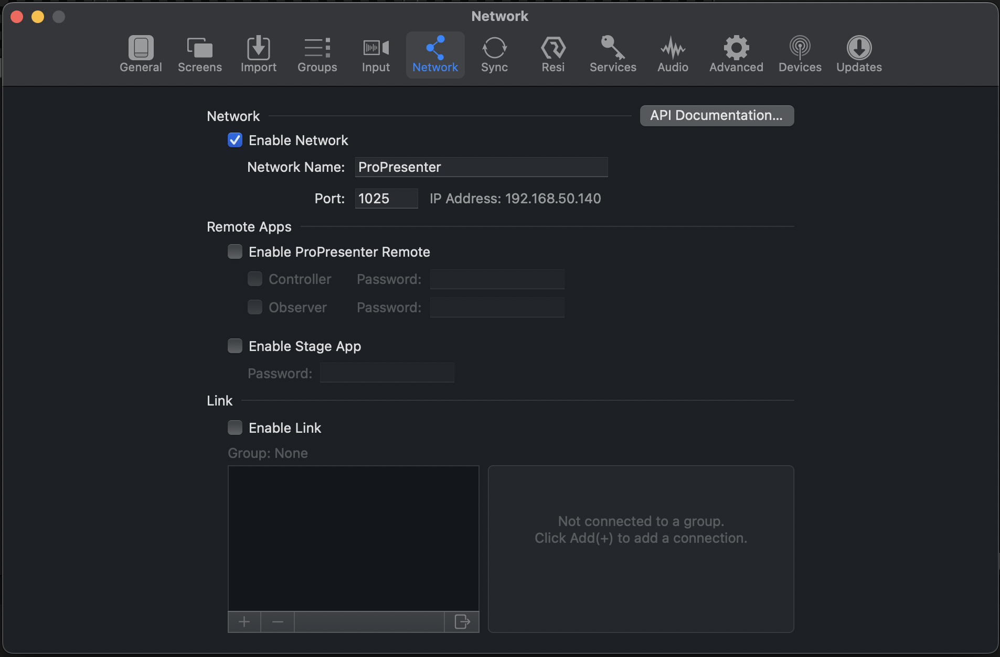

# ProPresenter Configuration

:::note

This page is still being written and may be incomplete.

:::

ProPresenter Monitor gives you a way to view the status of a presentation from anywhere on a local network.

## Setting up ProPresenter

To start, make sure you have ProPresenter version 7.9.1 or newer installed. You will also need to have your ProPresenter computer connected to the same network as your phone or device where you will be using the ProPresenter Monitor app.

### Network configuration

To allow your phone or remote device to view the status of ProPresenter, you will first need to enable network access in ProPresenter. This can be done by going to Preferences > Network. Check the box that says "Enable Network," and type in your desired network name and port. If you are unsure, leave it as the default.

Take note of the IP address and port number. This is what you will need to type in your app to connect.

## Connecting on the ProPresenter Monitor App

Open the app on your phone and type in the IP and port that you retrieved in the previous step. It should connect quickly. If it does not, verify that you are on the same network and that the IP and port were typed correctly. If you continue to be unable to connect, visit the troubleshooting page for more help.
